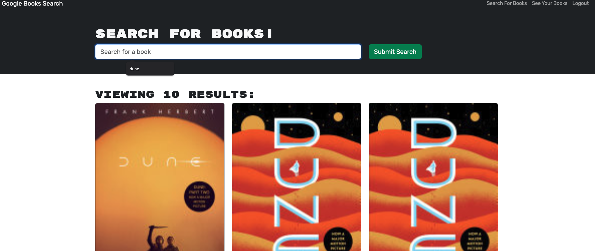
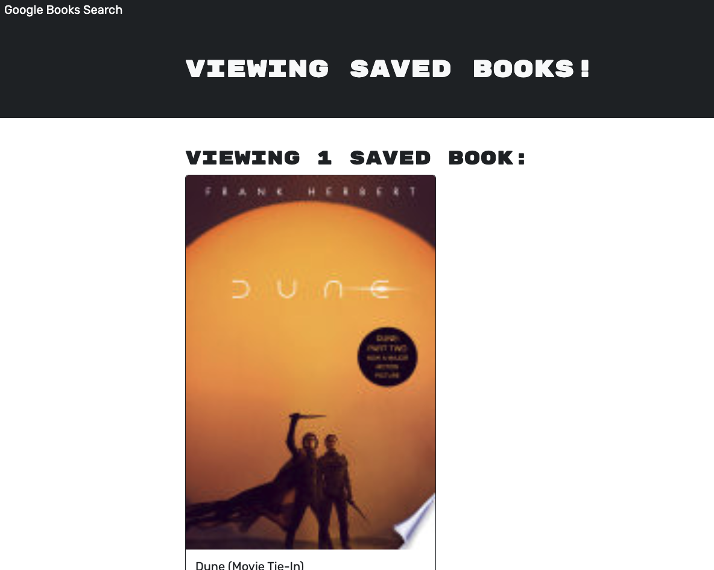

# MERN Google Book Search

  
## Description
This is a site that was refactored from using RESTful APIs to using GraphQL / ApolloServer. The site is a Google-powered book search, that returns details about books, and allows users to sign up and save books that they have searched for to their account.

## Table of Contents

- [Installation](#installation)
- [Usage](#usage)
- [Screenshots](#screenshots)
- [License](#license)
- [Contributing](#contributing)
- [Questions](#questions)

  
## Installation
The site simply requires a web browser to access and a valid e-mail address to begin saving books.

## Usage
Use the search bar on the page to look for books, and create an account or login to begin saving searched books to your account for later reference.

## Screenshots

## License
MIT

Copyright <2024> <PETER MARTINEZ>

Permission is hereby granted, free of charge, to any person obtaining a copy of this software and associated documentation files (the “Software”), to deal in the Software without restriction, including without limitation the rights to use, copy, modify, merge, publish, distribute, sublicense, and/or sell copies of the Software, and to permit persons to whom the Software is furnished to do so, subject to the following conditions:

The above copyright notice and this permission notice shall be included in all copies or substantial portions of the Software.

THE SOFTWARE IS PROVIDED “AS IS”, WITHOUT WARRANTY OF ANY KIND, EXPRESS OR IMPLIED, INCLUDING BUT NOT LIMITED TO THE WARRANTIES OF MERCHANTABILITY, FITNESS FOR A PARTICULAR PURPOSE AND NONINFRINGEMENT. IN NO EVENT SHALL THE AUTHORS OR COPYRIGHT HOLDERS BE LIABLE FOR ANY CLAIM, DAMAGES OR OTHER LIABILITY, WHETHER IN AN ACTION OF CONTRACT, TORT OR OTHERWISE, ARISING FROM, OUT OF OR IN CONNECTION WITH THE SOFTWARE OR THE USE OR OTHER DEALINGS IN THE SOFTWARE.

## Contributing
Please reach out to the developer via GitHub or e-mail below.

## Questions
For questions about this project, please reach out to me on GitHub, https://github/reasonablep or via e-mail at, pmrtnz@me.com. Thanks for reading. 
